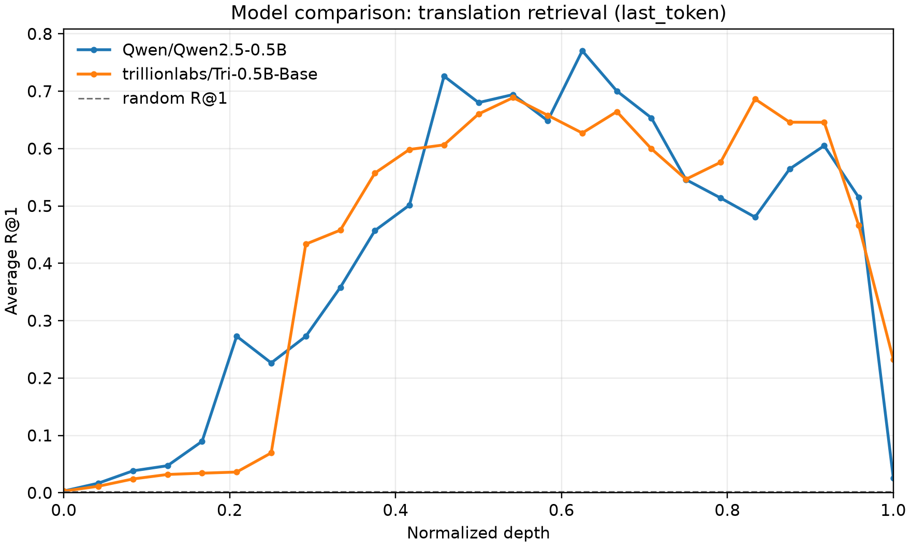
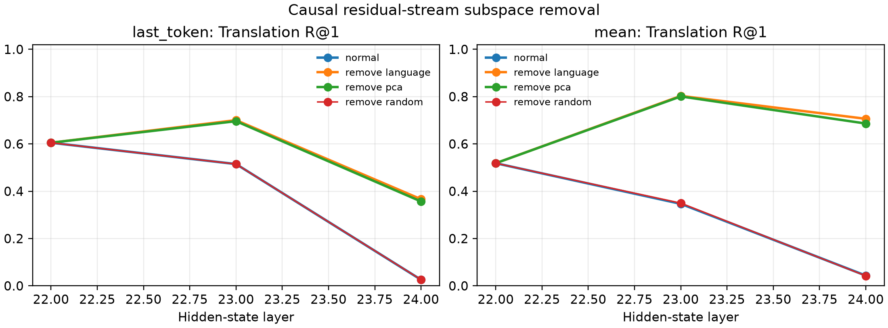

# Cross-Lingual Representations in Small Language Models

An empirical study of how multilingual sentence representations evolve across the layers of small causal language models and whether language-specific directions causally affect cross-lingual transfer.

The project compares **Tri-0.5B** and **Qwen2.5-0.5B** on English, Korean, Japanese, and Chinese. It combines layer-wise representation analysis with controlled residual-stream interventions, using reproducible pipelines designed to run on a single consumer GPU.



## What this project investigates

- Where translation-equivalent sentences become geometrically aligned inside a model.
- Whether an orthogonal mapping can recover alignment between languages.
- How semantic alignment coexists with linearly accessible language identity.
- Whether removing a small language-associated subspace changes retrieval and zero-shot intent transfer.
- What that intervention costs in next-token language-modeling performance.

## Method

Hidden states are extracted at every layer for aligned FLORES-200 sentences and pooled with either masked mean or last-token pooling. The analysis includes:

- bidirectional translation retrieval with R@1, R@5, R@10, and MRR;
- train-only orthogonal Procrustes alignment;
- linear language probes and tokenization controls;
- bootstrap uncertainty and sample-stability checks;
- zero-shot English-to-multilingual intent transfer on MASSIVE;
- causal residual-stream interventions with language-centroid, PCA, and random bases;
- next-token NLL evaluation after intervention.

All learned transformations use separate training and evaluation splits. Expensive model extraction is cached and kept separate from the lightweight analysis stages.

## Key findings

Cross-lingual alignment is not monotonic with depth. With last-token pooling, average translation R@1 peaks at **0.689** for Tri-0.5B and **0.771** for Qwen2.5-0.5B, then falls to **0.232** and **0.026** at the final layer. Language identity nevertheless remains almost perfectly linearly decodable there.

Removing only three language-associated residual directions at the selected late block improves final-layer FLORES R@1 and transfers beyond the original dataset:

| Model | Pooling | FLORES R@1: normal → intervention | MASSIVE target accuracy: normal → intervention |
|---|---|---:|---:|
| Tri-0.5B | mean | 0.124 → **0.325** | 0.297 → **0.444** |
| Tri-0.5B | last token | 0.232 → **0.310** | 0.071 → **0.367** |
| Qwen2.5-0.5B | mean | 0.043 → **0.706** | 0.264 → **0.420** |
| Qwen2.5-0.5B | last token | 0.026 → **0.366** | 0.324 → **0.365** |

The control experiments qualify this result: for Qwen, a label-free PCA basis explains most of the retrieval effect, while Tri shows a clearer language-specific component. The same interventions increase next-token NLL, sometimes substantially, so they are best understood as causal diagnostics rather than free performance improvements.



## Repository layout

```text
configs/                              Reproducible experiment configurations
src/cross_lingual_representations/   Reusable analysis library
scripts/                              Experiment and figure entry points
tests/                                Unit and integration tests
results/raw/                          Tidy experimental outputs
results/tables/                       Aggregated results
results/figures/                      Publication-ready figures
docs/RAPPORT_EXPERIMENTAL.md          Full experimental report (French)
```

## Run the project

Python 3.11+ and a CUDA-capable GPU are recommended for full extraction. CPU execution is supported but considerably slower.

```bash
python -m venv .venv
source .venv/bin/activate  # Windows PowerShell: .venv\Scripts\Activate.ps1
python -m pip install -e ".[dev]"
```

Run a lightweight end-to-end check:

```bash
python scripts/run_all.py --config configs/smoke.yaml
```

Run the two main representation pipelines:

```bash
python scripts/run_all.py --config configs/tri_05b_public.yaml
python scripts/run_all.py --config configs/qwen_05b_public.yaml
```

The specialized analyses are exposed as separate scripts so cached representations can be reused. See [`scripts/`](scripts/) for the available entry points and [`docs/RAPPORT_EXPERIMENTAL.md`](docs/RAPPORT_EXPERIMENTAL.md) for the complete protocol, commands, interpretation, and limitations.

## Quality checks

```bash
pytest
ruff check src scripts tests
mypy src
```

## Scope and limitations

The evidence covers two 0.5B-parameter base models, four languages, one parallel corpus, one downstream transfer task, and one primary sampling seed. Bootstrap intervals measure uncertainty over the evaluated examples, not over model pretraining, language selection, or corpus choice.

## License

Released under the [MIT License](LICENSE).
